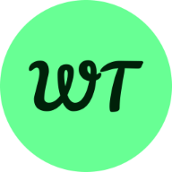
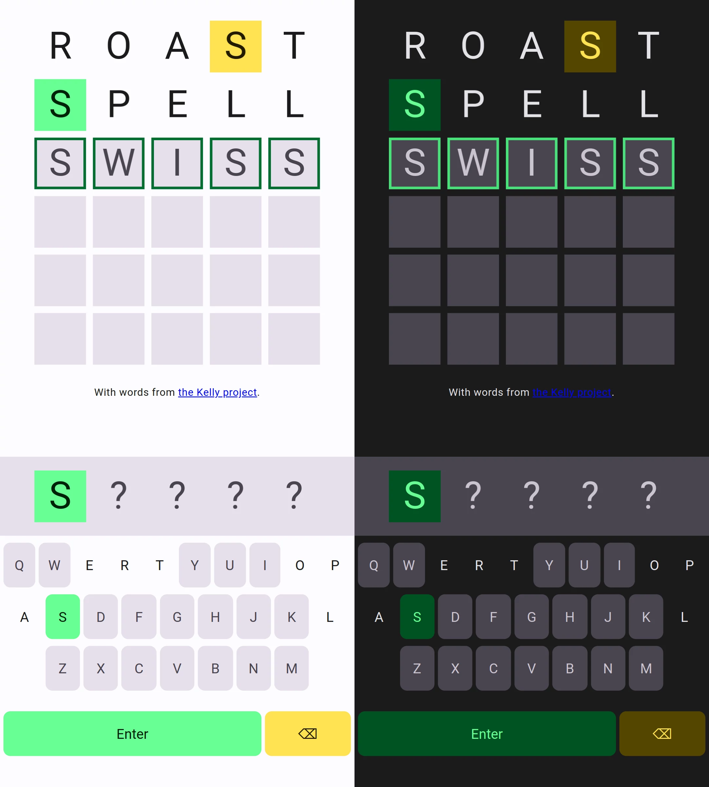

# Word Tiles

A simple Wordle clone that I created a while back and promptly forgot about.

THIS PROJECT IS NOT BEING ACTIVELY MAINTAINED

## Documentation

Word Tiles uses word lists separated based on [CEFR levels](https://www.coe.int/en/web/common-european-framework-reference-languages/level-descriptions). By default, English (B2) is used but this can be changed to increase or reduce the challenge (see below).

Currently, Word Tiles supports English and Swedish.

### Settings

Word Tiles supports changing settings via url query parameters. Settings are stored in your browser's [`localStorage`](https://developer.mozilla.org/en-US/docs/Web/API/Window/localStorage) so you don't have to provide the parameters more than once.

| query parameter | valid values             | default | description                                                                                                     |
| --------------- | ------------------------ | ------- | --------------------------------------------------------------------------------------------------------------- |
| lang            | [en, sv]                 | en      | Game language                                                                                                   |
| cefr            | [A1, A2, B1, B2, C1, C2] | B2      | Highest word list difficulty to use. Note that a value of `B1` would mean to use words from `A1`, `A2` and `A3` |
| wordLength      | 2 < wordLength < 15      | 5       | Length of the word to guess                                                                                     |
| maxAttempts     | 0 < maxAttempts < 100    | 6       | Max number of attempts before game over                                                                         |

#### Dark Mode

Light/dark mode is based on your browser's [`prefers-color-scheme`](https://developer.mozilla.org/en-US/docs/Web/CSS/@media/prefers-color-scheme)

## Screenshot

## Contributing

This project is not being actively maintained and does not currently accept contributions.

Please fork the project if you wish to make personal changes.

## License

[MIT](https://choosealicense.com/licenses/mit/)

Word lists from the [Kelly Project](https://spraakbanken.gu.se/en/projects/kelly) are distributed under [CC-BY-SA 3.0](https://creativecommons.org/licenses/by-sa/3.0/).
